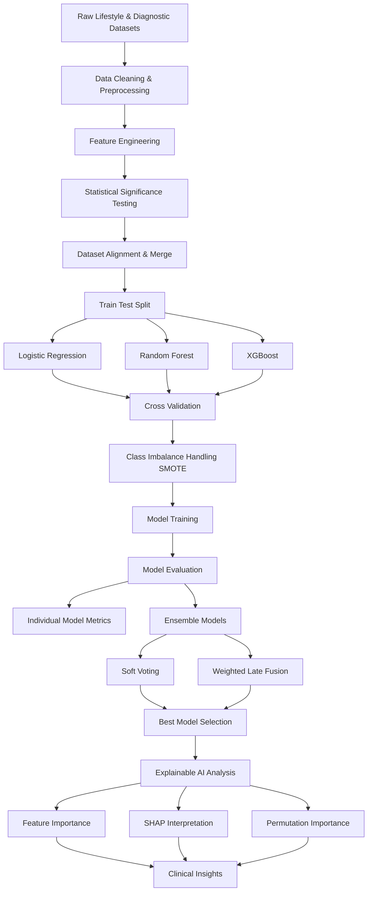

# ApneaSense: EnsembleXAI for Explainable Sleep-Apnea Risk Detection
An end-to-end **machine learning pipeline** for predicting **sleep apnea risk** using lifestyle, physiological, and cardiovascular indicators. 
The project integrates **ensemble learning, statistical analysis, and explainable AI (XAI)** to build interpretable predictive models.


---
## 📌 Project Overview

Sleep apnea is a common but underdiagnosed sleep disorder that can lead to serious health complications, including cardiovascular disease, hypertension, fatigue, and reduced quality of life. Early detection is important, but traditional diagnosis often requires expensive and time-consuming sleep studies such as polysomnography.

This project explores the use of **machine learning and explainable artificial intelligence (XAI)** to predict sleep apnea risk using easily obtainable health, lifestyle, and physiological indicators. The goal is to develop a predictive framework that can support **early screening and risk assessment**.

The project integrates several key components:

- **Statistical analysis** to identify clinically significant predictors of sleep apnea  
- **Machine learning models** including Logistic Regression, Random Forest, and XGBoost  
- **Class imbalance handling** using SMOTE to improve detection of apnea cases  
- **Ensemble learning methods** such as Soft Voting and Late Fusion to improve model robustness  
- **Explainable AI techniques** (feature importance, permutation importance, and SHAP analysis) to interpret model predictions  

Using a dataset of **1,374 samples with 21 health-related features**, the final system achieved approximately **ROC-AUC ≈ 0.71**, demonstrating the potential of machine learning models to detect patterns associated with sleep apnea risk. The results highlight the importance of **cardiovascular indicators, sleep quality metrics, and lifestyle factors** in predicting apnea risk. Although the model shows promising predictive performance for research applications, additional data and clinical validation are required before real-world deployment.

Overall, this project demonstrates how **interpretable machine learning approaches can support early identification of sleep apnea risk while providing transparent insights into the contributing health factors.**

## 📊 Dataset Summary

- **Sleep Disorder Diagnostic Dataset**  
  https://www.kaggle.com/datasets/ziya07/sleep-disorder-diagnostic-dataset  
  Clinical dataset containing physiological and cardiovascular indicators used for diagnosing sleep disorders.

- **Sleep Health and Lifestyle Dataset**  
  https://www.kaggle.com/datasets/uom190346a/sleep-health-and-lifestyle-dataset  
  Dataset including lifestyle, behavioral, and health factors that influence sleep quality and sleep disorders.

| Metric | Value |
|------|------|
| Total samples | 1,374 |
| Training samples | 1,099 |
| Test samples | 275 |
| Features used | 21 |
| Apnea prevalence | 28.17% |

### Dataset Sources

| Dataset | Apnea Prevalence |
|------|------|
| Lifestyle dataset | 20.86% |
| Diagnostic dataset | 30.90% |

---
# 🧠 Machine Learning Workflow


## 🔬 Statistical Significance Analysis

- **16 out of 21 features** were statistically significant (**p < 0.05**).

### Strongest Predictors

| Feature | p-value | Effect Size |
|------|------|------|
| Hypertension | 1.0e-33 | Large |
| Diastolic Blood Pressure | 1.65e-32 | Large |
| Cardiovascular Risk Score | 2.59e-32 | Large |
| Mean Arterial Pressure | 1.20e-31 | Large |
| Systolic Blood Pressure | 1.36e-30 | Large |

Most predictors showed **large clinical effect sizes**, indicating strong clinical relevance.

---

## 🤖 Model Performance

### Cross-Validation (10-Fold)

| Model | Accuracy | ROC-AUC | F1 |
|------|------|------|------|
| Logistic Regression | 0.7325 ± 0.0133 | 0.6376 | 0.2063 |
| Random Forest | 0.7116 ± 0.0386 | 0.6540 | 0.3480 |
| XGBoost | 0.7261 ± 0.0353 | 0.6600 | 0.3425 |

Models demonstrated **stable generalization with low train-test gaps**.

---

## 🧪 Test Set Evaluation

| Model | Accuracy | Precision | Recall | F1 | ROC-AUC |
|------|------|------|------|------|------|
| Logistic Regression | 0.7273 | 0.5556 | 0.1299 | 0.2105 | 0.6797 |
| Random Forest | 0.7127 | 0.4773 | 0.2727 | 0.3471 | 0.7027 |
| XGBoost | 0.7273 | 0.5217 | 0.3117 | 0.3902 | 0.7119 |

### Best Individual Model
**XGBoost**

---

## 🔗 Ensemble Model Performance

| Method | Accuracy | ROC-AUC |
|------|------|------|
| Soft Voting | 0.7345 | 0.7133 |
| Weighted Late Fusion | 0.7345 | 0.7126 |

🏆 **Best Overall Model:**  
**Soft Voting Ensemble**

---

## ⚖️ Effect of Class Balancing (SMOTE)

SMOTE improved apnea detection.

Largest improvement for **XGBoost**:

- Recall improvement: **+0.0779**
- F1 improvement: **+0.0538**

Trade-offs:

- Slight drop in **precision**
- Slight drop in **accuracy**

---

## 🧠 Explainable AI (XAI) Insights

Interpretability techniques identified key drivers of apnea risk.

### Feature Contribution

- **15 features explain 80% of predictions**
- **20 features explain 95% of predictions**

### Top Predictors

| Feature | Importance |
|------|------|
| Sleep_Deprived | 0.1213 |
| CV_Risk_Score | 0.1069 |
| Poor_Sleep_Quality | 0.0947 |
| BMI_Numeric | 0.0761 |
| Diastolic_BP | 0.0666 |

Most influential category:

**Cardiovascular Health Indicators**

---

## 🌍 Cross-Dataset Generalization

Generalization across datasets was limited.

### Diagnostic → Lifestyle

| Metric | Value |
|------|------|
| Accuracy | 0.7594 |
| ROC-AUC | 0.4197 |
| Recall | 0.0000 |

### Lifestyle → Diagnostic

| Metric | Value |
|------|------|
| Accuracy | 0.4180 |
| ROC-AUC | 0.4888 |
| Recall | 0.6861 |

This suggests **dataset distribution differences**.

---

## 📁 Project Structure

```
SleepApnea-AI
│
├── data
│   ├── lifestyle_dataset.csv
│   └── diagnostic_dataset.csv
├── notebooks
│   └── sleep_apnea_analysis.ipynb
└── README.md
```

---

## ⚙️ Installation

Clone the repository:

```
git clone https://github.com/yourusername/SleepApnea-AI.git](https://github.com/UmmayMaimonaChaman/ApneaSense-EnsembleXAI-for-Explainable-Sleep-Apnea-Risk-Detection

```

Install dependencies:

```
pip install -r requirements.txt
```

### Main libraries used

- scikit-learn  
- xgboost  
- imbalanced-learn  
- shap  
- pandas  
- numpy  
- matplotlib  
- seaborn  

---

## ▶️ Running the Project

Run the notebook:

```
notebooks/sleep_apnea_analysis.ipynb
```

The pipeline performs:

- Data preprocessing
- Feature engineering
- Statistical testing
- Model training
- Ensemble evaluation
- Explainable AI analysis

---

## ⚠️ Disclaimer

This model is intended **for research purposes only** and should **not be used for clinical diagnosis without medical validation**. If anyone wants to use or edit please contact chamanmaimona@gmail.com
Also, feel free to provide any suggesion for improvement.   :)

---

## 📚 Future Work

- Improve cross-dataset generalization
- Collect larger multi-population datasets
- Integrate deep learning models
- Build a clinical decision-support tool

---

## 👩‍💻 Author

**Ummay Maimona Chaman**

Machine Learning Project  
Sleep Apnea Risk Detection using Explainable AI and Ensemble

---
